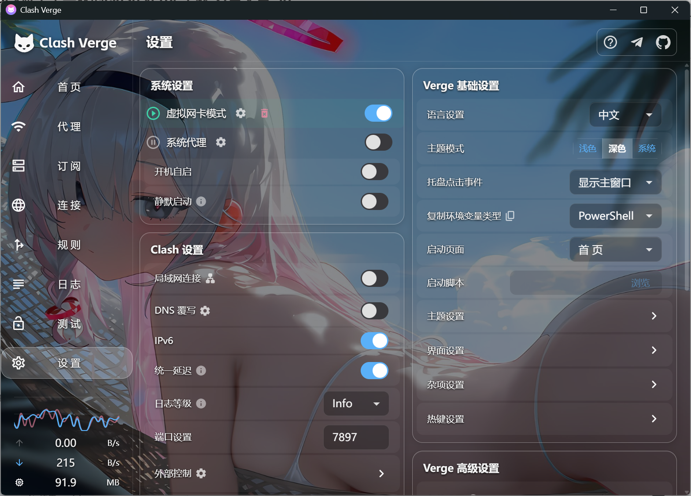
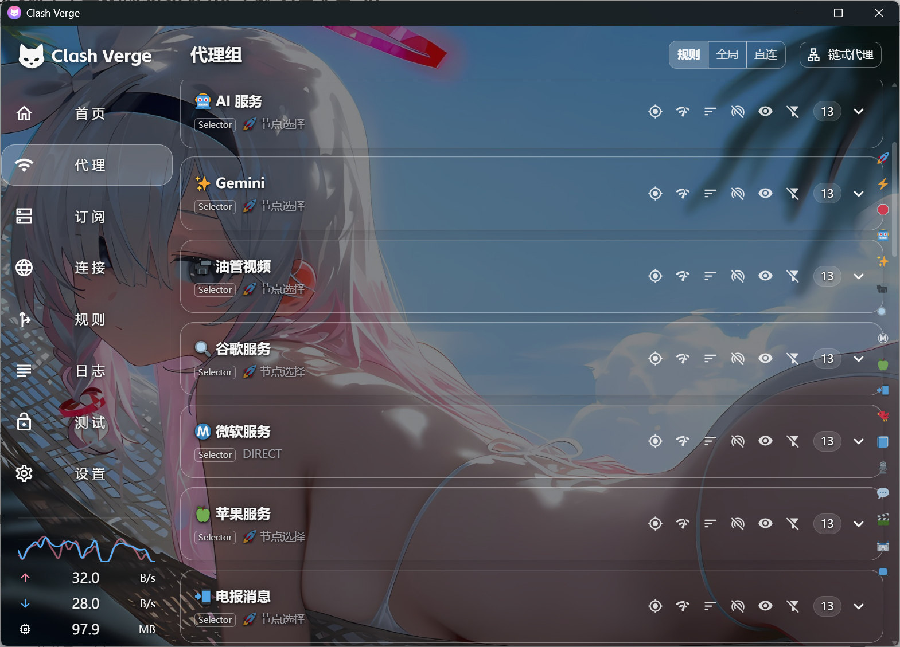
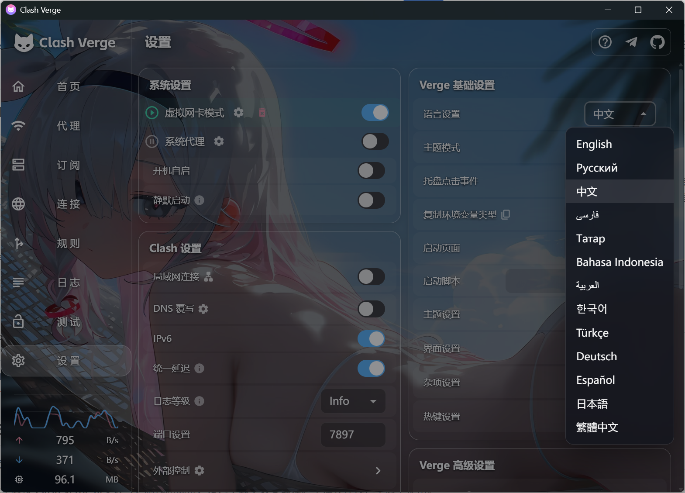
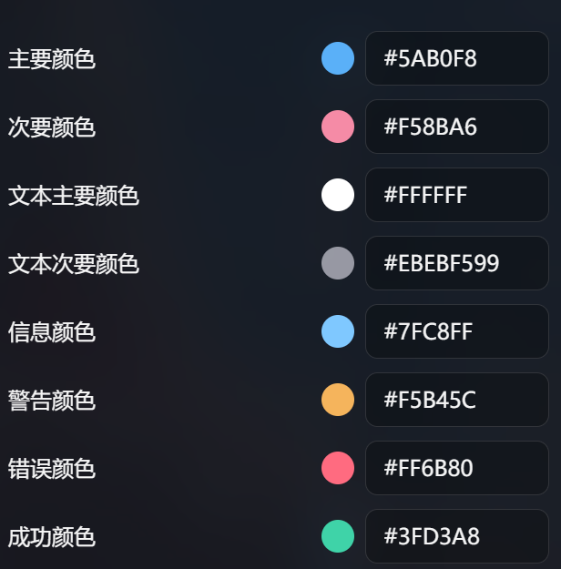

# Clash Verge Rev Glass Theme

一套为 Clash Verge Rev 制作的透明磨砂玻璃 CSS 主题，内置背景壁纸。

> 本主题按 **Clash Verge Rev v2.5.2** 制作和测试，**深色主题下效果最佳**。不建议在浅色主题下使用。

## 效果预览





### 透明度层级与浮层可读性



主题没有简单地把所有组件设成同一种透明度，而是分成多层处理：

1. 最底层显示完整壁纸，并用 `--cv-scrim` 覆盖一层统一暗色遮罩。
2. 主界面和主要卡片尽量保持透明，通过细边框、间距和轻阴影划分区域。
3. 正文使用短距离双层文字阴影，页面标题、侧栏菜单和代理组名使用更强的局部阴影，在复杂壁纸上保持清晰。
4. 菜单、弹窗和下拉列表使用更深的半透明底、20px 背景模糊、轻微饱和度与独立阴影；打开浮层时，页面背景还会额外压暗，因此不会与后面的文字重叠。

## 主题特点

- **尽量保留壁纸**：主要面板不使用大块实色填充，以透明区域、柔和边框和阴影建立玻璃层次。
- **针对复杂背景提高可读性**：全局遮罩负责整体明暗，文字阴影负责局部对比，不需要把每张卡片都变成不透明色块。
- **浮层单独加强**：Dialog、Popover、Menu、提示框和连接详情使用统一磨砂玻璃样式，比主页面更深、更模糊。
- **按组件精细适配**：首页、代理组与节点、订阅、设置、连接、规则、流量图、链式代理和解锁测试等区域分别处理，避免一条全局规则误伤其他页面。
- **交互状态清楚但克制**：悬停、选中、禁用、输入错误和键盘焦点都有独立反馈，同时保留代理延迟与成功、警告、错误等语义颜色。
- **滚动内容更稳定**：连接页固定表头使用半透明底与 6px 模糊，数据滚动到表头下方时不会出现文字叠在一起的观感。
- **跟随 Clash Verge 主色**：选中边线、下划线和焦点环会读取主题主色，并提供默认天蓝色作为兜底。
- **易于微调**：壁纸、遮罩、圆角、边框、文字、浮层和交互颜色集中在 CSS 顶部变量中；系统启用“减少动态效果”时，主题也会自动缩短过渡。

## 安装

1. 打开 Clash Verge Rev，进入“设置 → Verge 基础设置 → 主题设置 → CSS 注入”。
2. 将“主题模式”切换为“深色”。
3. 打开 CSS 注入编辑器，按 `Ctrl+A` 全选并删除旧内容，再粘贴 [`injection.css`](injection.css) 的全部内容。
4. 保存 CSS 编辑器，再保存主题设置。
5. 如果界面没有立即刷新，重启 Clash Verge Rev。

## 推荐颜色

下面这套配色是根据仓库当前附带的蓝灰、粉色壁纸选择的，目的是让按钮强调色与壁纸呼应，并保证深色模式下的文字和状态颜色清楚。它不是所有壁纸的通用最优解；更换壁纸后，可以优先调整主色、次色和信息色，成功、警告、错误色建议继续保持明确的语义区分。

```text
主色: #5AB0F8
次色: #F58BA6
主文字色: #FFFFFF
次文字色: #EBEBF599
信息色: #7FC8FF
警告色: #F5B45C
错误色: #FF6B80
成功色: #3FD3A8
```



## 更换背景图

### 使用仓库附带的在线壁纸

默认背景图位于 [`assets/wallpaper.jpg`](assets/wallpaper.jpg)，CSS 会通过 GitHub Raw 地址自动加载。

此方式需要能够访问 GitHub Raw。图片暂时加载失败时，主题会安全回退为深色背景，不会出现白屏。

如果你维护自己的 Fork，推荐用新图片替换 `assets/wallpaper.jpg`，并在 `injection.css` 顶部把 `--cv-wallpaper` 中的用户名、仓库名和分支名改成自己的实际地址。仓库必须公开，Raw 图片才能直接加载。

也可以直接改成其他图片直链：

```css
--cv-wallpaper: url("https://example.com/wallpaper.jpg");
```

### 使用自己的本地图片

本地图片不会依赖网络。推荐先将图片复制到一个路径简单、不会随意移动的位置，例如：

```text
C:\Users\Public\Pictures\ClashVergeTheme\wallpaper.jpg
```

然后打开 Clash Verge Rev 的 CSS 注入编辑器，找到文件顶部的 `--cv-wallpaper`，替换为：

```css
--cv-wallpaper: url("http://asset.localhost/C%3A%5CUsers%5CPublic%5CPictures%5CClashVergeTheme%5Cwallpaper.jpg");
```

保存 CSS 编辑器和外层主题设置；如果没有立即刷新，重启 Clash Verge Rev。

不能把 `C:\...` 或 `D:\...` 这样的 Windows 原始路径直接放进 `url()`。如果要使用其他路径，可在 PowerShell 中执行：

```powershell
$picturePath = 'D:\下载\我的壁纸.jpg'
'http://asset.localhost/' + [uri]::EscapeDataString($picturePath)
```

将输出的完整地址复制到：

```css
--cv-wallpaper: url("这里粘贴 PowerShell 输出的地址");
```

### 调整新壁纸的明暗

背景太亮或太暗时，调整 `injection.css` 顶部的遮罩透明度：

```css
--cv-scrim: rgba(6, 8, 14, 0.50);
```

最后一个数值越大，背景越暗；越小，背景越亮。

- 明亮、细节复杂的壁纸可以从 `0.55` 到 `0.65` 尝试。
- 较暗、主体简单的壁纸可以从 `0.35` 到 `0.50` 尝试。
- 需要轻微降低亮度或饱和度时，可调整 `--cv-wp-filter`，例如 `brightness(0.90) saturate(0.95)`。

## 兼容性

- 已针对 Clash Verge Rev v2.5.2 深色模式检查。
- 主题依赖当前版本的页面结构和 Chromium `:has()` 选择器。
- Clash Verge Rev 升级后若页面结构变化，个别组件可能需要重新适配。
- 本项目不是 Clash Verge Rev 官方主题。

## 许可证

CSS 与文档使用 [MIT License](LICENSE)。壁纸来源为“哲风壁纸”，已确认允许公开转载；壁纸不包含在 MIT 许可证内，其他使用方式仍按原作者或来源的授权执行。
